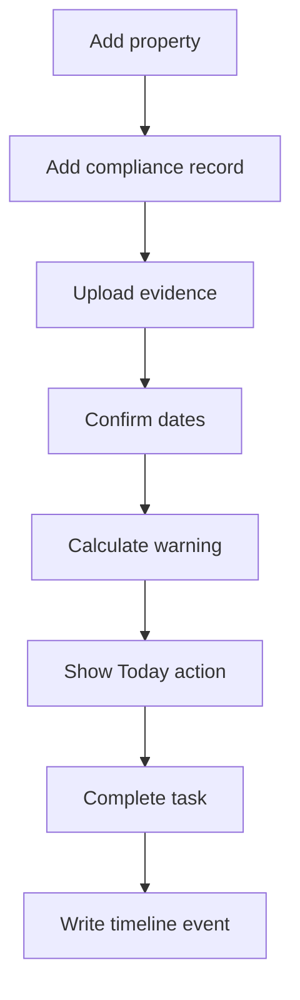

# PropertyOS Alpha Build Specification

**Company:** KaelVaren  
**Product:** PropertyOS  
**Release:** Private Alpha  
**Status:** Build-ready  
**Primary user:** Independent UK residential landlord managing 5–50 properties

## 1. Purpose

Build a secure, database-backed PropertyOS web application that Karl can test with a real portfolio.

The Alpha must prove one central proposition:

> Property and compliance information can be converted into reliable daily actions and a useful property history.

The existing PropertyOS Sites prototype is the visual and workflow reference. It is not the production codebase.

## 2. Alpha success criteria

The Alpha succeeds when a landlord can:

1. Sign in securely.
2. Add and maintain properties.
3. Record a tenancy without storing unnecessary sensitive identity data.
4. Add a compliance record and supporting document.
5. See due, expired and missing items calculated consistently.
6. Receive a recommended action on Today.
7. Complete the action.
8. See the change in the property timeline.
9. Record and track a maintenance issue.
10. Export their structured data.

Karl should be able to use the Alpha with his own portfolio for two to four weeks without relying on the public prototype.

## 3. Product principles

- **Today first:** lead with decisions and actions, not data entry.
- **Evidence linked:** important statuses and actions link to their source.
- **Deterministic before generative:** dates, warnings and health statuses come from rules and queries.
- **Human confirmed:** AI-extracted facts never update compliance records without confirmation.
- **Calm by default:** reserve urgent language for genuinely urgent conditions.
- **UK specific:** use UK terminology, dates, currency and compliance categories.
- **Private by default:** invitation-only access, minimum personal data and row-level security.
- **Standalone:** PropertyOS must not depend on TradeOS, TradeCircle or Fire Safety modules.

## 4. In scope

### Identity and account

- Email sign-in and sign-out through Supabase Auth
- One or more members per organisation
- Roles: owner, admin, member, viewer
- Organisation-level data isolation

### Properties

- Create, view, edit and archive a property
- UK address, property type, bedrooms and notes
- Record declared ownership through reusable individual, joint, limited-company,
  trust, partnership or other ownership entities
- Support multiple owners and ownership percentages per property
- Portfolio list and property detail

### Tenancies

- Current and historical tenancy dates
- Monthly rent and payment day
- Tenant display name or initials
- No identity documents, bank details or Right to Rent evidence in Alpha

### Compliance

- Configurable requirement catalogue
- Property compliance records
- Statuses: compliant, due soon, expired, missing, needs review, not applicable
- Issue, expiry, review and completion dates
- Source document and notes
- Default initial categories: Gas Safety, EPC, EICR, Deposit Protection, Right to Rent, Smoke Alarms, CO Alarms, Landlord Insurance

### Documents

- Private upload and download
- Property, compliance and maintenance association
- Manual classification
- Processing and confirmation status
- Extracted metadata stored separately from confirmed operational facts

### Tasks

- Manual and system-generated tasks
- Priority, due date, status and source
- Complete, cancel and reopen actions

### Maintenance

- Issue, priority, status, contractor, cost estimate and notes
- Supporting document association

### Timeline

- Append-only operational events for important creates, updates and completions
- Property, actor, source record and event metadata
- Timeline events are not used as the source of current state

### Today

- Portfolio counts
- Compliance due within 45 days
- Expired and missing compliance
- Overdue and upcoming tasks
- Open high-priority maintenance
- Tenancies ending within 60 days
- Recommended actions ordered by urgency and due date

### Export

- Organisation-scoped JSON or CSV export of structured Alpha data
- Documents exported separately through authorised download links

## 5. Explicitly out of scope

- Full rent collection, arrears and accounting
- Open banking
- Tenant, contractor or agent portals
- TradeOS or TradeCircle integration
- Professional fire-risk-assessment authoring
- Automated legal conclusions or certification
- Unconfirmed AI updates
- Native iOS and Android releases
- Subscription billing
- Government, council or regulator integrations
- Complex reporting and custom workflow builders

## 6. Primary vertical slice

This slice is complete only when it works across authentication, database, storage, UI and row-level security.

## 7. Core screens

| Screen | Alpha responsibility |
|---|---|
| Sign in | Authenticate invited users |
| Today | Briefing, risks, upcoming dates and recommended actions |
| Properties | Searchable portfolio list and property creation |
| Property detail | Overview, tenancy, compliance, documents, maintenance, tasks and timeline |
| Compliance | Portfolio-wide status table and filters |
| Documents | Upload, classify, confirm and inspect evidence |
| Tasks | Filter, create, update and complete actions |
| Maintenance | Log and progress property issues |
| Settings | Account, organisation, notifications and export |

The standalone conversational Assistant is deferred until the underlying evidence model is proven.

## 8. Architecture

| Layer | Decision |
|---|---|
| Client | Flutter Web, structured for later mobile targets |
| State management | Riverpod |
| Navigation | GoRouter |
| Database | Supabase PostgreSQL |
| Authentication | Supabase Auth |
| File storage | Private Supabase Storage bucket |
| Access control | PostgreSQL Row-Level Security |
| Server logic | SQL functions, views and Supabase Edge Functions where secrets are required |
| AI | OpenAI API called only from a server-side function |
| Source control | Private KaelVaren GitHub repository |
| Environments | Local, development and production |

No OpenAI or Supabase service-role secret may be shipped in the Flutter client.

## 9. Data and security requirements

- Every business record belongs to an `organisation_id`.
- Ownership records describe the user's declared arrangement; PropertyOS does
  not verify legal or beneficial ownership or determine tax treatment.
- Every organisation-scoped table has RLS enabled.
- Access is derived from authenticated organisation membership.
- Storage objects use an organisation-prefixed path.
- Archived records remain recoverable and excluded from normal views.
- User actions record `created_at`, `updated_at` and actor where appropriate.
- Sensitive logs must not contain document contents or personal data.
- Use fictional or minimised tenant details during early testing.
- Production data must never be loaded into the public Sites prototype.
- Backups, export and deletion behaviour must be tested before inviting external users.

## 10. Today rules

The first Today briefing is generated from database queries:

| Condition | Output |
|---|---|
| Compliance expired | Urgent action |
| Compliance missing | High action |
| Expiry within 14 days | High action |
| Expiry within 15–45 days | Medium action |
| Task overdue | Priority derived from task |
| High/urgent maintenance open | High action |
| Tenancy ends within 30 days | High review action |
| Tenancy ends within 31–60 days | Medium review action |

Each recommendation must include its property, source type, source record, reason, due date and deep link.

## 11. AI boundary

AI document extraction is Phase 2 of the Alpha.

It may:

- Suggest document type and property
- Extract issue, expiry and review dates
- Extract certificate or policy references
- Assign confidence to each proposed value
- Explain which document text supports a suggestion

It may not:

- Certify legal compliance
- Silently overwrite confirmed facts
- Generate a compliance status without deterministic rules
- expose one organisation's data to another

## 12. Delivery sequence

### Milestone 1 — Foundation

- Repository, environments and continuous checks
- Supabase project and versioned migrations
- Auth, organisations, memberships and RLS tests
- Flutter shell and navigation

### Milestone 2 — Vertical slice

- Properties
- Compliance records
- Private document upload
- Today warning
- Task completion
- Timeline event

### Milestone 3 — Working portfolio

- Tenancies
- Maintenance
- Portfolio-wide compliance
- Export
- Responsive and accessibility pass

### Milestone 4 — Assisted documents

- Secure extraction function
- Proposed facts and confidence
- Confirmation workflow
- Evidence-linked results

### Milestone 5 — Private validation

- Import Karl's eight properties
- Use daily for two to four weeks
- Record friction and missing workflows
- Invite two or three trusted landlords
- Decide the commercial MVP from observed use

## 13. Quality gates

- Automated formatting, analysis and tests pass.
- Database migration applies cleanly to an empty Supabase project.
- RLS tests prove cross-organisation access is denied.
- The vertical slice has an end-to-end test.
- Today results are covered by date-boundary tests.
- Keyboard navigation and common responsive widths are usable.
- Errors provide recovery guidance without leaking internal details.
- Seed data is fictional and clearly separated from production data.

## 14. Alpha acceptance test

Given an authenticated owner with a property, when they create a Gas Safety record expiring in 31 days and attach a certificate, PropertyOS must:

1. Store the record and private evidence.
2. Calculate `due_soon`.
3. Show a dated action on Today.
4. Link the action to the property and evidence.
5. Allow the action to be completed.
6. Record the completion in the property timeline.
7. Prevent a user from another organisation reading any of those records.

## 15. Alpha disclaimer

> PropertyOS helps organise information and highlight potential compliance actions. It does not provide legal advice, certify compliance or replace professional landlord, legal or compliance advice.
